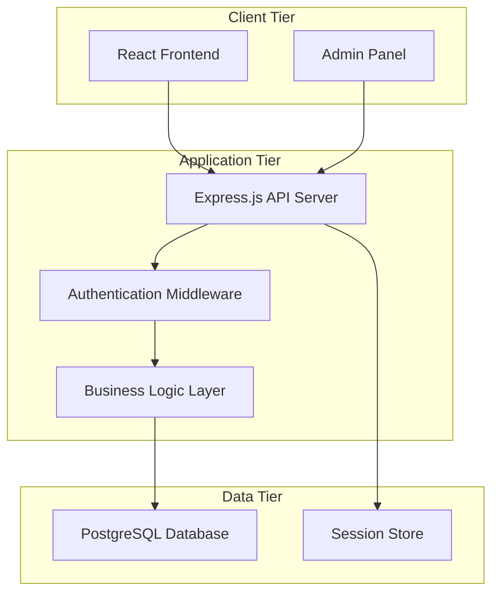
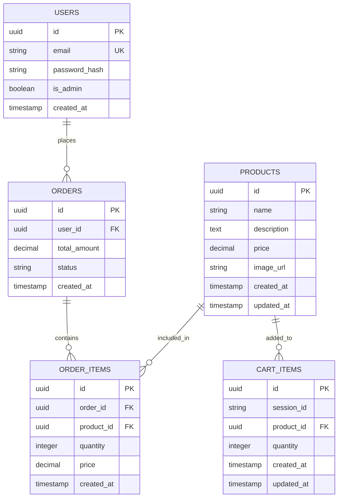

# Technical Design Document

## Overview

This document presents the technical design for a basic e-commerce website that enables customers to browse products, manage shopping carts, authenticate, and place orders. The system follows a three-tier architecture with a React frontend, Node.js/Express backend API, and PostgreSQL database.

The design emphasizes clean separation of concerns, RESTful API principles, and modern web development practices. The system supports both customer-facing functionality (product browsing, cart management, checkout) and administrative capabilities (product management).

### Key Design Principles

- **Separation of Concerns**: Clear boundaries between presentation, business logic, and data layers
- **RESTful Architecture**: Standard HTTP methods and resource-based URLs
- **Responsive Design**: Mobile-first approach with progressive enhancement
- **Security**: Input validation, authentication, and secure session management
- **Scalability**: Stateless API design and normalized database schema

## Architecture

### System Architecture

The system follows a traditional three-tier web application architecture:



### Technology Stack

**Frontend:**
- React 18 with functional components and hooks
- React Router for client-side routing
- Axios for HTTP requests
- CSS Modules for styling
- Responsive design with CSS Grid and Flexbox

**Backend:**
- Node.js runtime environment
- Express.js web framework
- bcrypt for password hashing
- express-session for session management
- cors for cross-origin resource sharing
- helmet for security headers

**Database:**
- PostgreSQL for relational data storage
- pg (node-postgres) for database connectivity
- Database migrations for schema management

**Deployment:**
- Frontend: Vercel or Netlify
- Backend: Railway or Render
- Database: Supabase or Railway PostgreSQL

## Components and Interfaces

### Frontend Components

#### Core Components

**App Component**
- Root component managing global state and routing
- Handles user authentication state
- Provides shopping cart context to child components

**ProductList Component**
- Displays grid of available products
- Implements responsive layout for different screen sizes
- Handles loading states and empty product scenarios

**ProductCard Component**
- Reusable component for individual product display
- Shows product image, name, price, and description
- Includes "Add to Cart" functionality

**ProductDetail Component**
- Detailed view for individual products
- Displays full product information and larger images
- Provides quantity selection and cart addition

**ShoppingCart Component**
- Displays cart contents with product details
- Allows quantity updates and item removal
- Shows running total and checkout button

**Authentication Components**
- LoginForm: User login with email/password
- RegisterForm: New user registration
- AuthGuard: Protects authenticated routes

**Checkout Component**
- Order summary and confirmation
- Integrates with authentication system
- Handles order submission and success feedback

#### Admin Components

**AdminDashboard Component**
- Overview of products and recent orders
- Navigation to product management functions

**ProductManagement Component**
- CRUD operations for products
- Form validation and error handling
- Bulk operations support

### Backend API Endpoints

#### Product Endpoints
```
GET    /api/products          - Retrieve all products
GET    /api/products/:id      - Retrieve specific product
POST   /api/products          - Create new product (admin only)
PUT    /api/products/:id      - Update product (admin only)
DELETE /api/products/:id      - Delete product (admin only)
```

#### Authentication Endpoints
```
POST   /api/auth/register     - User registration
POST   /api/auth/login        - User login
POST   /api/auth/logout       - User logout
GET    /api/auth/profile      - Get current user profile
```

#### Order Endpoints
```
POST   /api/orders            - Create new order
GET    /api/orders            - Get user's orders
GET    /api/orders/:id        - Get specific order details
```

#### Cart Endpoints
```
GET    /api/cart              - Get current cart contents
POST   /api/cart/items        - Add item to cart
PUT    /api/cart/items/:id    - Update cart item quantity
DELETE /api/cart/items/:id    - Remove item from cart
DELETE /api/cart              - Clear entire cart
```

### API Request/Response Formats

#### Product Resource
```json
{
  "id": "uuid",
  "name": "string",
  "description": "string",
  "price": "decimal",
  "image_url": "string",
  "created_at": "timestamp",
  "updated_at": "timestamp"
}
```

#### User Resource
```json
{
  "id": "uuid",
  "email": "string",
  "created_at": "timestamp"
}
```

#### Order Resource
```json
{
  "id": "uuid",
  "user_id": "uuid",
  "items": [
    {
      "product_id": "uuid",
      "quantity": "integer",
      "price": "decimal"
    }
  ],
  "total_amount": "decimal",
  "status": "string",
  "created_at": "timestamp"
}
```

## Data Models

### Database Schema

#### Products Table
```sql
CREATE TABLE products (
    id UUID PRIMARY KEY DEFAULT gen_random_uuid(),
    name VARCHAR(255) NOT NULL,
    description TEXT,
    price DECIMAL(10,2) NOT NULL CHECK (price >= 0),
    image_url VARCHAR(500),
    created_at TIMESTAMP DEFAULT CURRENT_TIMESTAMP,
    updated_at TIMESTAMP DEFAULT CURRENT_TIMESTAMP
);
```

#### Users Table
```sql
CREATE TABLE users (
    id UUID PRIMARY KEY DEFAULT gen_random_uuid(),
    email VARCHAR(255) UNIQUE NOT NULL,
    password_hash VARCHAR(255) NOT NULL,
    is_admin BOOLEAN DEFAULT FALSE,
    created_at TIMESTAMP DEFAULT CURRENT_TIMESTAMP
);
```

#### Orders Table
```sql
CREATE TABLE orders (
    id UUID PRIMARY KEY DEFAULT gen_random_uuid(),
    user_id UUID NOT NULL REFERENCES users(id),
    total_amount DECIMAL(10,2) NOT NULL CHECK (total_amount >= 0),
    status VARCHAR(50) DEFAULT 'pending',
    created_at TIMESTAMP DEFAULT CURRENT_TIMESTAMP
);
```

#### Order Items Table
```sql
CREATE TABLE order_items (
    id UUID PRIMARY KEY DEFAULT gen_random_uuid(),
    order_id UUID NOT NULL REFERENCES orders(id) ON DELETE CASCADE,
    product_id UUID NOT NULL REFERENCES products(id),
    quantity INTEGER NOT NULL CHECK (quantity > 0),
    price DECIMAL(10,2) NOT NULL CHECK (price >= 0),
    created_at TIMESTAMP DEFAULT CURRENT_TIMESTAMP
);
```

#### Cart Items Table (Session-based)
```sql
CREATE TABLE cart_items (
    id UUID PRIMARY KEY DEFAULT gen_random_uuid(),
    session_id VARCHAR(255) NOT NULL,
    product_id UUID NOT NULL REFERENCES products(id),
    quantity INTEGER NOT NULL CHECK (quantity > 0),
    created_at TIMESTAMP DEFAULT CURRENT_TIMESTAMP,
    updated_at TIMESTAMP DEFAULT CURRENT_TIMESTAMP,
    UNIQUE(session_id, product_id)
);
```

### Data Relationships



### Business Logic Models

#### Cart Management
- Cart items are session-based for anonymous users
- Cart persists across browser sessions using session storage
- Cart automatically calculates totals and handles quantity updates
- Cart validation ensures product availability and positive quantities

#### Order Processing
- Orders capture cart state at time of purchase
- Order items store historical price to handle price changes
- Order status tracking (pending, confirmed, shipped, delivered)
- Order totals are calculated and validated server-side

#### User Authentication
- Password hashing using bcrypt with salt rounds
- Session-based authentication with secure cookies
- Role-based access control (customer vs admin)
- Session timeout and cleanup mechanisms
## Correctness Properties

*A property is a characteristic or behavior that should hold true across all valid executions of a system-essentially, a formal statement about what the system should do. Properties serve as the bridge between human-readable specifications and machine-verifiable correctness guarantees.*

### Property 1: Product Display Completeness

*For any* product in the system, when rendered in the product catalog, the display should include product name, price, description, and image URL.

**Validates: Requirements 1.3**

### Property 2: Product Navigation Consistency

*For any* product displayed in the product listing, clicking on that product should navigate to the correct product detail page with matching product ID.

**Validates: Requirements 1.2**

### Property 3: Cart Management Operations

*For any* product and valid quantity, adding the product to cart, updating its quantity, and removing it should maintain cart consistency and accurate totals throughout all operations.

**Validates: Requirements 2.1, 2.2, 2.4, 2.5**

### Property 4: Cart Display Accuracy

*For any* cart contents, the displayed cart should show each product with correct quantity, individual price, and accurate total calculations.

**Validates: Requirements 2.3**

### Property 5: Authentication Round Trip

*For any* valid user credentials, the complete authentication flow (register → login → logout) should work correctly and maintain proper session state.

**Validates: Requirements 3.2, 3.4, 3.7**

### Property 6: Authentication Form Validation

*For any* user input to registration and login forms, the system should properly validate email and password fields and accept valid data.

**Validates: Requirements 3.1, 3.3**

### Property 7: Authentication Error Handling

*For any* invalid credentials submitted to the authentication system, the system should return appropriate error messages without authenticating the user.

**Validates: Requirements 3.5**

### Property 8: Order Completion Process

*For any* authenticated user with items in their cart, completing checkout should create a proper order record, include all cart items with correct totals, and clear the cart.

**Validates: Requirements 4.2, 4.3, 4.5**

### Property 9: Order Display and Confirmation

*For any* successful order placement, the system should display an order summary with correct total price and show confirmation message.

**Validates: Requirements 4.1, 4.4**

### Property 10: Payment Simulation

*For any* order processed through the system, the payment should be simulated (not processed) and the order should be recorded successfully.

**Validates: Requirements 4.6**

### Property 11: API RESTful Compliance

*For any* API endpoint in the system, it should follow RESTful conventions with appropriate HTTP methods and resource-based URLs.

**Validates: Requirements 5.1**

### Property 12: API CRUD Operations

*For any* resource (products, users, orders), the API should provide complete CRUD operations with proper HTTP methods and responses.

**Validates: Requirements 5.2, 5.3, 5.4**

### Property 13: API Error Handling

*For any* invalid data submitted to API endpoints, the system should return appropriate HTTP status codes and structured error messages.

**Validates: Requirements 5.5, 5.7**

### Property 14: API Input Validation

*For any* data submitted to API endpoints, the system should validate all inputs before processing and reject invalid data.

**Validates: Requirements 5.6**

### Property 15: Database Referential Integrity

*For any* database operation involving related tables, referential integrity constraints should be enforced and prevent invalid relationships.

**Validates: Requirements 6.5**

### Property 16: Database Data Types and Constraints

*For any* data stored in the database, it should conform to the defined data types and constraints (e.g., positive prices, valid email formats).

**Validates: Requirements 6.6**

### Property 17: Admin Product Management

*For any* product operation in the admin panel (create, edit, delete), the changes should be immediately persisted to the database and reflected in the system.

**Validates: Requirements 7.1, 7.3, 7.4, 7.5**

### Property 18: Admin Product Listing

*For any* products in the system, the admin panel should display all existing products in the management interface.

**Validates: Requirements 7.2**

### Property 19: Admin Authentication Protection

*For any* admin panel functionality, access should require proper administrator authentication before allowing operations.

**Validates: Requirements 7.6**

## Error Handling

### Frontend Error Handling

**Network Errors**
- API request failures should display user-friendly error messages
- Retry mechanisms for transient network issues
- Graceful degradation when backend services are unavailable

**Validation Errors**
- Real-time form validation with immediate feedback
- Clear error messages for invalid input formats
- Prevention of form submission with invalid data

**State Management Errors**
- Cart state corruption recovery
- Authentication state synchronization
- Local storage error handling

### Backend Error Handling

**Request Validation**
- Input sanitization and validation middleware
- Structured error responses with consistent format
- Appropriate HTTP status codes for different error types

**Database Errors**
- Connection pool management and retry logic
- Transaction rollback on operation failures
- Constraint violation handling with meaningful messages

**Authentication Errors**
- Secure error messages that don't reveal system information
- Rate limiting for authentication attempts
- Session timeout and cleanup

**Business Logic Errors**
- Inventory validation for cart operations
- Order processing error recovery
- Data consistency checks

### Error Response Format

```json
{
  "error": {
    "code": "VALIDATION_ERROR",
    "message": "Invalid input data",
    "details": [
      {
        "field": "email",
        "message": "Email format is invalid"
      }
    ],
    "timestamp": "2024-01-15T10:30:00Z"
  }
}
```

## Testing Strategy

### Dual Testing Approach

The system employs both unit testing and property-based testing to ensure comprehensive coverage:

**Unit Tests**: Verify specific examples, edge cases, and error conditions
- Authentication with known credentials
- Cart operations with specific products
- Order creation with sample data
- API endpoint responses with fixed inputs
- Database operations with test data

**Property Tests**: Verify universal properties across all inputs
- Cart calculations with randomly generated products and quantities
- Authentication flows with generated user credentials
- API validation with various input combinations
- Database constraints with random data
- Admin operations with generated product data

### Property-Based Testing Configuration

**Testing Library**: fast-check for JavaScript/TypeScript property-based testing
**Test Configuration**: Minimum 100 iterations per property test
**Test Tagging**: Each property test references its design document property

Example property test structure:
```javascript
// Feature: basic-ecommerce-website, Property 3: Cart Management Operations
fc.assert(fc.property(
  fc.record({
    product: productGenerator,
    quantity: fc.integer({min: 1, max: 10})
  }),
  (data) => {
    // Test cart add, update, remove operations
    // Verify cart consistency and totals
  }
), {numRuns: 100});
```

### Unit Testing Strategy

**Frontend Testing**
- Component rendering with React Testing Library
- User interaction simulation with fireEvent
- Mock API responses for integration testing
- Accessibility testing with jest-axe

**Backend Testing**
- API endpoint testing with supertest
- Database operation testing with test database
- Authentication middleware testing
- Error handling verification

**Integration Testing**
- End-to-end user workflows
- Database transaction testing
- API contract validation
- Cross-browser compatibility

### Test Coverage Requirements

- Minimum 80% code coverage for critical business logic
- 100% coverage for authentication and payment simulation
- Property tests for all identified correctness properties
- Unit tests for edge cases and error conditions
- Integration tests for complete user workflows

### Testing Environment

**Test Database**: Separate PostgreSQL instance with test data
**Mock Services**: External service mocking for isolated testing
**Test Data**: Factories for generating consistent test data
**CI/CD Integration**: Automated testing on all pull requests